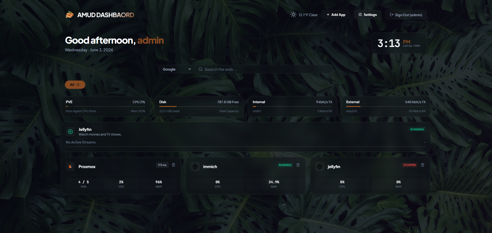

# AMUD Dashboard

AMUD (Advanced Modern Unified Dashboard) is a high-performance, intelligent home lab cockpit engineered strictly for resource-constrained environments. While legacy dashboards demand heavy runtimes, bloated frameworks, and complex text-file configurations, AMUD provides a single-binary, zero-dependency ecosystem control center that idles under **10MB of RAM** (combined server and agent).

**📚 Official Documentation:** [https://boubli.github.io/AMUD-Dashboard/](https://boubli.github.io/AMUD-Dashboard/)

**Ready to deploy? Refer directly to our [AMUD Deployment Guide](DEPLOY.md) for automated installer scripts, Portainer configs, and Docker CLI instructions.**

---

## Why AMUD Demolishes Legacy Dashboards (Heimdall, Homepage, Homarr)

### 1. Bare-Metal Resource Discipline
* **The Legacy Problem:** Heimdall relies on a heavy PHP/Laravel lifecycle, requiring background web servers (Nginx/Apache) and PHP-FPM daemons that swallow 150MB+ RAM just sitting idle. 
* **The AMUD Solution:** Written in pure, compiled Rust. It executes native machine code with zero interpreter overhead, running the entire dashboard, telemetry layer, and database inside a strict **~10MB RAM** envelope at idle.

### 2. Zero-YAML, 100% UI-Driven Control
* **The Legacy Problem:** Next-gen dashboards force you to spend hours manually writing, indenting, and debugging hundreds of lines of complex YAML text files just to add a shortcut.
* **The AMUD Solution:** Powered by an embedded, ultra-fast **SQLite (Rusqlite)** architecture. You get the advanced layout categories, tagging, and sub-pages of a modern dashboard, but configured entirely through an elegant, reactive user interface. 

### 3. Active Cockpit vs. Passive Bookmarks
* **The Legacy Problem:** Traditional dashboards are just glorified lists of web links. If a service freezes or crashes, they are completely blind to it.
* **The AMUD Solution:** 
  * **Asynchronous Tokio Telemetry:** Background tokio threads concurrently poll your metrics and stream live updates to the UI via WebSockets without blocking your browser or causing layout lags.
  * **Integrated Live Clock, Search & Category Filters:** View a live-updating local clock and customized greetings based on the hour of the day, search the web with a configurable search widget, and filter applications dynamically client-side with category filter tabs.
  * **Dynamic Media Streams:** The dashboard automatically hides Plex/Jellyfin stream cards if those applications aren't registered in your homelab database, showing them only when configured.

### 4. Admin vs. Guest Profiles
* **The Legacy Problem:** Sharing your landing page with family members usually means exposing your sensitive admin tools (Proxmox, Portainer) or setting up massive external proxy layers.
* **The AMUD Solution:** Built-in cryptographic user roles. Admins see the full cluster control array (with add/delete buttons and settings drawer); guests or family profiles get a clean, read-only dashboard layout out of the box.

---

## Microscopic Production Footprint

| Dimension | Heimdall Application Dashboard | AMUD Dashboard |
| :--- | :---: | :---: |
| **Engine** | PHP 8+ / Laravel | Rust / Axum / Tokio |
| **Runtime Overhead** | High (Interpreted PHP-FPM) | Zero (Native Compiled Machine Code) |
| **Assets Injection** | Read from host disk paths | Embedded templates (`include_str!`) + static files |
| **Idle RAM Footprint** | 80MB - 150MB | **~10MB (Combined server/agent)** |
| **Boot Time** | 2 - 5 seconds | **Sub-millisecond (Instant)** |
