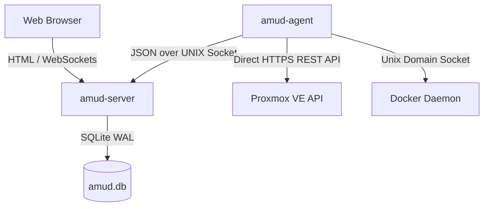

<div align="center">
  
</div>

# AMUD Dashboard

[](https://github.com/boubli/AMUD-Dashboard/releases/latest)


A compiled, zero-dependency homelab control center and telemetry dashboard.

Unlike legacy dashboards (Heimdall, Homepage, Homarr) that run on heavy runtimes (PHP-FPM, Node.js) and rely on complex nested YAML configuration files, AMUD is written in compiled Rust and persisted entirely in SQLite. Combined, the server and telemetry agent idle at **35MB to 100MB of RAM** with sub-millisecond route execution.

## Architecture & Design Decisions

AMUD is split into two native binaries:
1. **`amud-server`**: Axum-based web server serving server-rendered HTML (templated via Alpine.js) and managing state via SQLite.
2. **`amud-agent`**: Standalone daemon installed on the homelab host. It queries host metrics, Proxmox VE containers, and Docker runtimes, streaming raw JSON payloads back to the server via Unix Domain Sockets (UDS) or TCP.



### Technical Stack Justifications

#### Rust & Axum
* **No Runtime Overhead**: Compiles directly to native machine code. Eliminates the JVM/V8 startup and heap overhead.
* **Concurrent Event Loop (Tokio)**: Telemetry streams and third-party integrations (AdGuard, Pi-hole, Plex, Home Assistant) poll concurrently on Tokio green threads. Telemetry is serialized once per poll tick and broadcasted to WebSockets using a `tokio::sync::watch` channel.

#### SQLite Persistence (`rusqlite`)
* **Zero YAML**: Configuration is stored in an embedded SQLite database. Layouts, category tabs, and settings are configured directly via the UI, bypassing YAML syntax headaches.
* **Performance**: Configured in WAL (Write-Ahead Logging) mode, enabling concurrent reads and low-latency writes without external network overhead.

#### Direct Telemetry Collection
* **Zero Shell Subprocesses**: Legacy solutions fork system calls like `pvesh` or `curl` every few seconds to grab container stats, resulting in high CPU overhead.
* **Natively Networked**: `amud-agent` utilizes `hyper` and `rustls` to send native HTTPS REST API calls to Proxmox VE and reads the Docker daemon directly over the UNIX socket via `hyperlocal`.

---

## Telemetry Configuration

### Proxmox VE Integration
Host metrics function automatically. For LXC container monitoring, the agent must be authenticated to the Proxmox VE REST API.

#### 1. Generate API Token
In the Proxmox VE Web UI:
1. Navigate to **Datacenter → Permissions → API Tokens**.
2. Click **Add**. Select User (e.g., `root@pam`) and Token ID (e.g., `amud`).
3. **Uncheck** *Privilege Separation* so the token inherits the user's VM/System audit permissions.
4. Copy the returned Secret key.

#### 2. Pass Token to Agent
Set the environment variable on the host running the agent:
```bash
PVE_API_TOKEN=PVEAPIToken=root@pam!amud=XXXXXXXX-XXXX-XXXX-XXXX-XXXXXXXXXXXX
```

---

## Deployment

### Docker Compose

For containerized hosts (combines server and agent communicating over a shared volume for the Unix socket):

```yaml
services:
  amud-server:
    image: tradmss/amud-dashboard:latest
    entrypoint: ["/app/amud-server"]
    ports:
      - "8000:8000"
    environment:
      - AMUD_AGENT_SECRET=change-me-to-a-long-random-string
    volumes:
      - /opt/amud/data:/app/data
      - /opt/amud/run:/opt/amud/run
    restart: unless-stopped

  amud-agent:
    image: tradmss/amud-dashboard:latest
    entrypoint: ["/app/amud-agent"]
    environment:
      - AMUD_AGENT_SECRET=change-me-to-a-long-random-string
      - PVE_API_TOKEN=PVEAPIToken=root@pam!amud=XXXXXXXX-XXXX-XXXX-XXXX-XXXXXXXXXXXX
    volumes:
      - /opt/amud/run:/opt/amud/run
    restart: unless-stopped
```

### Proxmox LXC Autopilot Script
For native installation within a Proxmox VE LXC container (running outside Docker), execute this on your Proxmox VE host:
```bash
curl -sSL https://github.com/boubli/AMUD-Dashboard/releases/latest/download/setup-amud.sh | bash
```

---

## Production Resource Footprint

| Dimension | Heimdall (Legacy PHP) | AMUD Dashboard (Rust) |
| :--- | :--- | :--- |
| **Engine** | PHP 8+ / Laravel | Rust / Axum / Tokio |
| **Execution Overhead** | High (Interpreted PHP-FPM) | Zero (Native Machine Code) |
| **Asset Delivery** | Disk reads per request | Embedded in binary via `include_str!` |
| **Idle RAM Footprint** | ~150MB | **35MB - 100MB** (Combined) |
| **Startup / Boot Time**| ~2 - 5 seconds | **Sub-millisecond** |

---

## Support & Donation

* [GitHub Sponsors](https://github.com/sponsors/boubli)
* [Donate via Stripe](https://buy.stripe.com/cNi14n6b9a7v5Jg4Rq4ko00)
* [Ko-fi](https://ko-fi.com/Youssefboubli)
