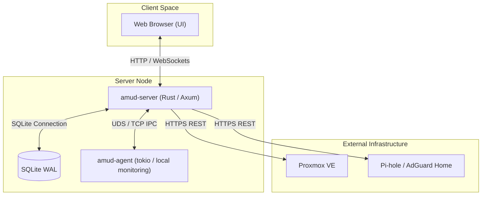

# System Architecture

This document describes the architectural design, data flows, security boundaries, and components of the AMUD homelab portal.

## Overview

AMUD is a decoupled operations dashboard built to monitor local network services, virtualization hosts, and media servers. The architecture consists of a lightweight server daemon (`amud-server`) and a companion monitoring agent (`amud-agent`).

---

## Component Details

### 1. Web UI & Frontend
- **Design Philosophy**: Static-first premium glassmorphism layout, utilizing TailwindCSS/Vanilla CSS configurations and Alpine.js for lightweight state management.
- **Client-Side Storage**: Stateless sessions backed entirely by secure server-side HTTP-only cookies.
- **WebSockets**: Leveraged for real-time telemetry updates (CPU, memory, storage, networks, active media streams) pushed dynamically to the browser without page reloads.

### 2. `amud-server` (The Control Plane)
- **Framework**: Axum-based asynchronous web application framework running on Tokio runtime.
- **Routing & Middleware**:
  - CSRF validation utilizing custom headers (`X-CSRF-Token`) for JSON payloads and input fields for standard forms.
  - Role-based access control (RBAC) separating **Admin** users from **Guest** viewers.
  - Strict Content Security Policy (CSP) headers injecting dynamic cryptographically secure nonces on template script/style elements.
  - In-memory session store (`RwLock<HashMap<String, Session>>`) mapped to cryptographically secure session IDs.

### 3. Decoupled Server-Agent UDS/TCP IPC
- **Communication Protocol**: Custom framing over Unix Domain Sockets (UDS) on Linux/Unix systems, falling back to secure local TCP loopback sockets on Windows environments.
- **Challenge-Response Auth**: Prevent unauthorized processes from connecting to the server socket. The agent must perform a cryptographic challenge-response validation using a shared secret before telemetry is accepted.
- **Data Model**: The agent operates as a telemetry gatherer (monitoring host resources, system load, active network interfaces, LXC containers).

### 4. SQLite Storage & Concurrency
- **Configuration**: Single-file SQLite database configured in Write-Ahead Logging (WAL) mode to allow concurrent readers without blocking writes.
- **Secrets at rest**: Integration API keys (Plex, Jellyfin, Proxmox, Pi-hole, etc.) are encrypted with ChaCha20-Poly1305 at rest using a key from `AMUD_SECRETS_KEY` or `data/.amud-secrets-key`.

---

## Data Flow

### Telemetry Pipeline
1. `amud-agent` collects local container statistics, memory load, and system metrics.
2. `amud-agent` frames the payload and sends it over UDS/TCP to the server.
3. `amud-server` receives and processes the telemetry.
4. Active guest or admin WebSocket clients receive the payload filtered by their authorization role (sensitive LXC/container names are hidden from Guest views).

### External Integrations
- App-card integrations (AdGuard, Pi-hole, Radarr, Sonarr, Overseerr, Jellyseerr, RSS) are fetched by `amud-server` **on demand** when a card loads its integration widget.
- Jellyfin, Plex, and Home Assistant are polled on background intervals when configured.
- The dashboard loads widget details asynchronously via authenticated, CSRF-hardened API requests.
